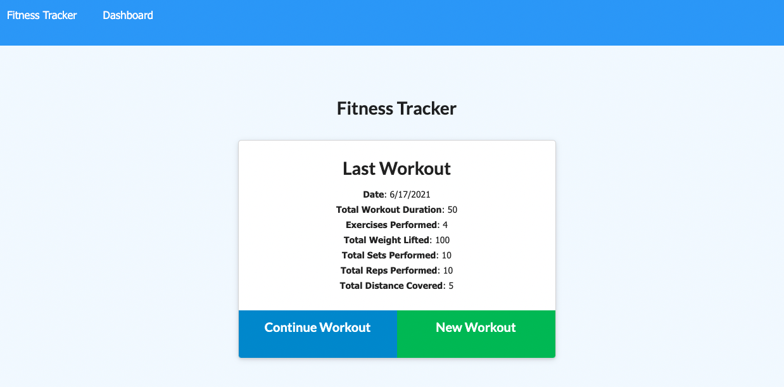

# Workout-Tracker

## Table of contents
 * [General info](#General-Info)
 * [Specifics](#Specifics)
 * [Deployment of application](#Deployment-of-application)
 * [Application Code](#Application-Code)
 * [Screenshots](#Screenshots)
 * [Future Developments](#Future-Developments)

 # General Info

  Workout Tracker is an application that allows user to create, view and truck workouts with no limits on daily logs.

 # Specifics

   * Fitness Tracker

     Users can choose to create a new workout or continue with the workout they already created earlier.
   
     * Creating New Workout:
       * User can add new workout by clicking on “New Workout” button.
       * There are 2 options to choose from: Resistance and Cardio type of workouts.
       * Depending on the type of exercise form will be presented to the user to fill in.
       * After user can either “Add Exercise” or “Complete”
       * If user click on complete exercise button, the stats from the workout will be presented to the user

     * Continue Existing Workout:

       * User can continue the workout by clicking “Continue Workout” 
       * User should choose the type of workout and fill the form accordingly as for “create new workout” option. 

   * Dashboard Page:

     * User can view combined weight of multiple exercises from the past 7 workouts
     * Users can view total duration of every workout from the past 7 workouts

 # Deployment of application

   To run a project, please follow the link 

   [https://stay-fit-tracker.herokuapp.com/](https://stay-fit-tracker.herokuapp.com/)

 # Application Code

   To view application code, please follow the link 

   [https://github.com/sheymanidze/Workout-Tracker](https://github.com/sheymanidze/Workout-Tracker)

 # Screenshots

  ### Fitness Tracker main page
   

   ### Dashboard page
   

  ### Resistance type of workout form
   

   ### Cardio type of workout form
   

 # Future Developments

 * More types of exercise will be added
 * When user type the exercise name the autocomplete will be available
 * More charts will be included to represen user’s current fitness level, goals, accomploshments
